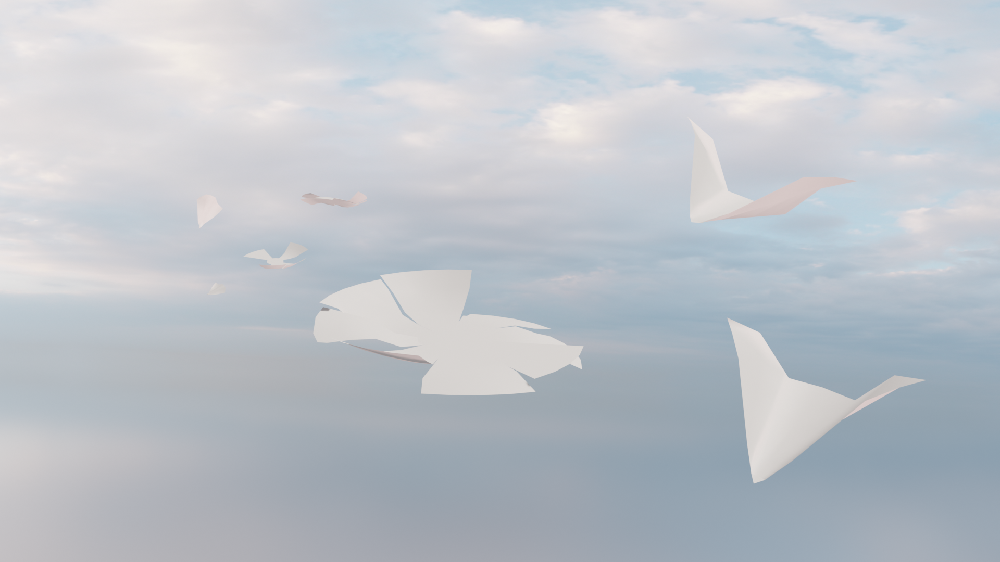
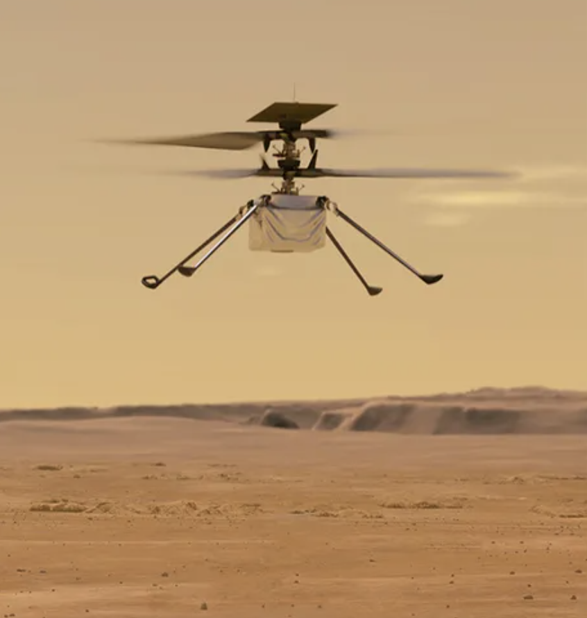

# ALBATROSS
*A flying device that hover like baby Albatrosses to minimize its energy consumption.*

By Julia Sangnakkara

## Concept

Most drones consume energy inefficiently during flight, relying on continuous motor power that severely limits their endurance. In contrast, birds such as the common swift and young albatross can remain airborne or at sea for months by using wind and air currents instead of fighting them. Inspired by these birds, I imagined a bio-inspired aerial robot that exploits wind energy to stay aloft, gliding and adapting its flight like a bird.

## Technical specificities

I imagined a robot that doesn’t exactly resemble a bird. As technology and science advance in the near future, we will be able to design more creative and unconventional shapes for flying robots, going beyond strictly biological forms.

This robot cannot be built with today’s technology, but in the near future it could rely on ultra-efficient solar cells, high-density batteries, and a very low-power processor. Connected to a network of similar robots, it would share global wind data in real time. Multiple units could also physically gather and fuse into a single larger structure, forming a more stable and energy-efficient hovering system by increasing surface area and improving aerodynamic performance through collective flight.

### Potential Applications

This robot could be used by companies as an airborne internet relay or a mobile weather station, capable of operating for long durations with minimal energy. Its wind-powered, gliding design also makes it suitable for deployment on other planets with atmospheres. By exploiting environmental forces instead of relying on constant propulsion, it offers a promising alternative to drone helicopters such as Ingenuity on Mars, enabling longer missions, wider coverage, and reduced energy constraints.

*Ingenuity undertakes its first test flight on Mars in this illustration. Credits : NASA / JPL-Caltech*

### Contemplating Tomorrow’s Robots

During my design process, I reflected on how these robots might continue to exist even without humans. They could hover in distant skies for months, silently moving with the wind, fulfilling no task but their own presence. Imagining them enduring beyond us highlights their autonomy and energy efficiency, and raises questions about how machines can persist and interact with their environment long after we are gone. In a way, their quiet persistence becomes a reflection on the future of technology and the traces we leave behind.

### References

Maruccia, Alfonso. ‘This Bird-Inspired Drone Is More Energy Efficient and Proficient at Complex Flight Maneuvers’. TechSpot, 6 December 2024. [https://www.techspot.com/news/105865-bird-inspired-drone-more-energy-efficient-proficient-complex.html](https://www.techspot.com/news/105865-bird-inspired-drone-more-energy-efficient-proficient-complex.html).

ResearchGate. ‘Soft Robots Using SMPs. a) Self‐folding Pyramid by Activating the Four...’ Accessed 21 January 2026. [https://www.researchgate.net/figure/Soft-robots-using-SMPs-a-Self-folding-pyramid-by-activating-the-four-hinges_fig9_343829255](https://www.researchgate.net/figure/Soft-robots-using-SMPs-a-Self-folding-pyramid-by-activating-the-four-hinges_fig9_343829255).

_Ingenuity Mars Helicopter - NASA Science_. Ingenuity (Helicopter). 8 April 2024. 137. [https://science.nasa.gov/mission/mars-2020-perseverance/ingenuity-mars-helicopter/](https://science.nasa.gov/mission/mars-2020-perseverance/ingenuity-mars-helicopter/).
